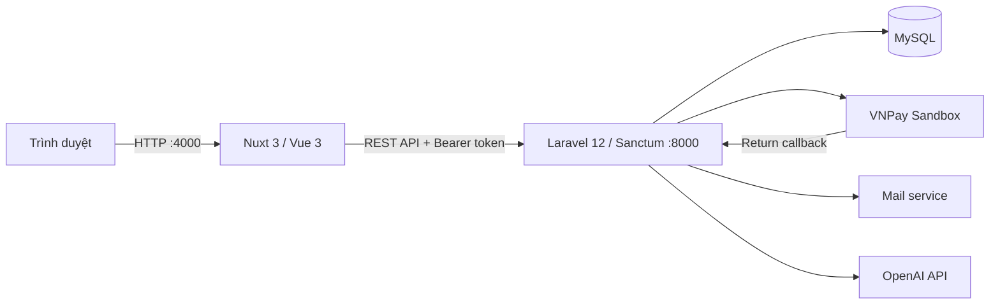
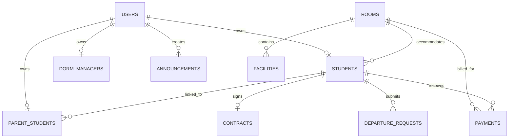

# DATN-KTX — Hệ thống quản lý ký túc xá

DATN-KTX là hệ thống web hỗ trợ quản lý sinh viên, phụ huynh, phòng ở, cơ sở vật chất, hợp đồng, yêu cầu rời ký túc xá, hóa đơn điện nước và thanh toán VNPay.

## Kiến trúc



- Frontend: Nuxt 3, Vue 3, Pinia, Tailwind CSS, Axios.
- Backend: PHP 8.2+, Laravel 12, Laravel Sanctum, Eloquent ORM.
- Cơ sở dữ liệu: MySQL.
- Frontend mặc định: `http://localhost:4000`.
- Backend mặc định: `http://localhost:8000`.

## Vai trò và quyền

| Vai trò | Chức năng chính |
|---|---|
| Student | Xác minh hồ sơ, hoàn thành đăng ký, xem phòng/hợp đồng/hóa đơn, gửi yêu cầu rời KTX |
| Parent | Xem thông tin sinh viên liên kết, thanh toán đúng hóa đơn của sinh viên, xác nhận hoàn tiền |
| Staff | Quản lý nghiệp vụ vận hành theo các API quản trị được cấp |
| Admin | Quản lý người dùng, sinh viên, phòng, hợp đồng, hóa đơn, cơ sở vật chất, thông báo và yêu cầu rời KTX |

Các API sinh viên, phụ huynh và quản trị được bảo vệ bằng Sanctum và middleware vai trò. API tạo thanh toán kiểm tra thêm quyền sở hữu hóa đơn.

## ERD



`utility_prices` lưu đơn giá điện/nước theo thời gian. `school_students` là nguồn dữ liệu học sinh của trường dùng trong bước xác minh. Các bảng hệ thống khác gồm personal access tokens, cache và jobs.

## Luồng nghiệp vụ chính

### Tiếp nhận sinh viên

1. Sinh viên đăng ký tài khoản.
2. Hệ thống đối chiếu thông tin học sinh của trường.
3. Sinh viên hoàn thiện hồ sơ và chọn/xếp phòng.
4. Hệ thống tạo hợp đồng và hóa đơn liên quan.
5. Quản trị theo dõi trạng thái sinh viên, phòng và hợp đồng.

### Hóa đơn và VNPay

1. Quản trị phát sinh hóa đơn từ mức sử dụng và đơn giá.
2. Sinh viên hoặc phụ huynh liên kết chọn hóa đơn `unpaid`.
3. Backend lấy số tiền trực tiếp từ database và tạo URL VNPay.
4. VNPay trả kết quả về backend.
5. Backend xác minh chữ ký, mã hóa đơn, số tiền và trạng thái giao dịch trước khi cập nhật `paid`.
6. Callback lặp không ghi nhận giao dịch lần thứ hai.

### Rời ký túc xá và hoàn tiền

1. Sinh viên gửi yêu cầu rời KTX.
2. Admin duyệt hoặc từ chối yêu cầu.
3. Khi duyệt, hệ thống kết thúc hợp đồng, chuyển sinh viên/tài khoản sang `Inactive` và giải phóng phòng.
4. Nếu có tiền cọc, hệ thống tạo phiếu `refund_pending`.
5. Phụ huynh xác nhận đã nhận tiền; phiếu chuyển sang `refunded`.
6. Hệ thống giữ lại lịch sử sinh viên, hợp đồng và hóa đơn để tra cứu.

## Cài đặt

Yêu cầu: PHP 8.2+, Composer, Node.js/npm và MySQL.

### Backend

```bash
cd backend
composer install
copy .env.example .env
php artisan key:generate
php artisan migrate --seed
php artisan serve
```

Điền kết nối MySQL, mail, VNPay và OpenAI trong `backend/.env` trước khi chạy. Sau khi thay đổi cấu hình, chạy `php artisan config:clear`.

### Frontend

```bash
cd Frontend
npm install
npm run dev
```

Có thể tạo `Frontend/.env`:

```dotenv
NUXT_PUBLIC_API_BASE=http://localhost:8000/api
NUXT_PUBLIC_STORAGE_BASE=http://localhost:8000/storage
```

Nếu dùng ảnh upload, chạy `php artisan storage:link` trong thư mục backend.

## Biến môi trường backend quan trọng

```dotenv
APP_URL=http://localhost:8000
FRONTEND_URL=http://localhost:4000
CORS_ALLOWED_ORIGINS=http://localhost:4000

VNPAY_TMN_CODE=
VNPAY_HASH_SECRET=
VNPAY_URL=https://sandbox.vnpayment.vn/paymentv2/vpcpay.html
VNPAY_RETURN_URL=http://localhost:8000/api/vnpay/return

OPENAI_API_KEY=
```

Không commit `.env` hoặc khóa bí mật. `VNPAY_RETURN_URL` phải là URL backend mà VNPay truy cập được trong môi trường triển khai.

## Kiểm tra trước khi demo

```bash
cd backend
php artisan migrate:status
php artisan route:list
php artisan test

cd ../Frontend
npm run build
```

Kịch bản demo đề xuất: đăng nhập sinh viên → xem phòng/hợp đồng → đăng nhập phụ huynh → xem hóa đơn → thanh toán VNPay sandbox → kiểm tra hóa đơn `paid` → gửi và duyệt yêu cầu rời KTX → xác nhận hoàn tiền.

## Giới hạn hiện tại

- Tích hợp thanh toán đang sử dụng VNPay; mã thử nghiệm MoMo chưa hoàn chỉnh đã được loại khỏi bản bàn giao.
- Email phụ thuộc cấu hình mail của môi trường.
- Chatbot phụ thuộc `OPENAI_API_KEY` và kết nối mạng.

Xem thêm [hướng dẫn backend](backend/README.md) và [hướng dẫn frontend](Frontend/README.md).
